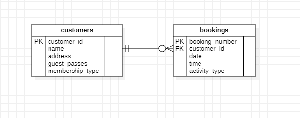

# Fit Kwick

A gym management web application developed with [Node js](https://nodejs.org/en). All the pages are server side rendered that offers wonderful performance to the clients.

## Technologies Used

- Node JS
- Express JS
- EJS
- MySQL

## Backend

Backend is developed using [Node js](https://nodejs.org/en) with [Express JS](https://expressjs.com/) on top of it which makes it very easy to create server and handle routes.

Express JS offers great ease in developing RESTful API that is used to manage the routes on this web application which then interats with [MySQL](https://www.mysql.com/) database.

MySQL allows great number of options which makes it super easy to design complex databases for large applications. For this project the following ERD was followed.

## Frontend

Frontend was developed with [EJS](https://ejs.co/) which is node js library that allows users to inject data right from the backend, essentially allowing the development of Server Side Routes.

It has its own syntax which is written in `.ejs` files.
